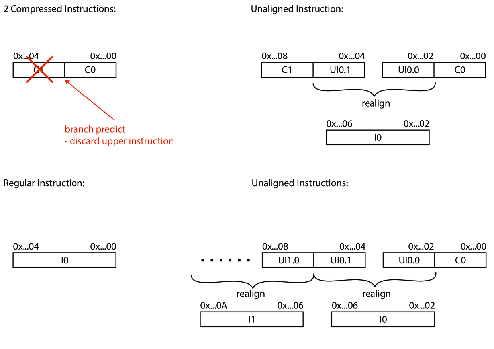

# Instruction Decode

Instruction decode is the fist pipeline stage of the processor's
back-end. Its main purpose is to distill instructions from the data
stream it gets from IF stage, decode them and send them to the issue
stage.

With the introduction of compressed instructions (in general variable
length instructions) the ID stage gets a little bit more complicated: It
has to search the incoming data stream for potential instructions,
re-align them and (in the case of compressed instructions) decompress
them. Furthermore, as we will know at the end of this stage whether the
decoded instruction is branch instruction it passes this information on
to the issue stage.

#### Instruction Re-aligner

As mentioned above the instruction re-aligner checks the incoming data
stream for compressed instructions. Compressed instruction have their
last bit unequal to 11 while normal 32-bit instructions have their last
two bit set to 11. The main complication arises from the fact that a
compressed instruction can make a normal instruction unaligned (e.g.:
the instruction starts at a half word boundary). This can (in the worst
case) mandate two memory accesses before the instruction can be fully
decoded. We therefore need to make sure that the fetch FIFO has enough
space to keep the second part of the instruction. Therefore the
instruction re-aligner needs to keep track of whether the previous
instruction was unaligned or compressed to correctly decide what to do
with the upcoming instruction.

Furthermore, the branch-prediction information is used to only output
the correct instruction to the issue stage. As we only predict on
word-aligned PCs the passed on branch prediction information needs to be
investigated to rule out which instruction we are actually need, in case
there are two instructions (compressed or unaligned) present. This means
that we potentially have to discard one of the two instructions (the
instruction before the branch target). For that reason the instruction
re-aligner also needs to check whether this fetch entry contains a valid
and taken branch. Depending on whether it is predicted on the upper 16
bit it has to discard the lower 16 bit accordingly. This process is
illustrate in .

#### Compressed Decoder

As mentioned earlier we also need to decompress all the compressed
instructions. This is done by a small combinatorial circuit which takes
a 16-bit compressed instruction and expands it to its 32-bit equivalent.
All compressed instructions have a 32-bit equivalent.

#### Decoder

The decoder either takes the raw instruction data or the uncompressed
equivalent of the 16-bit instruction and decodes them accordingly. It
transforms the raw bits to the most fundamental control structure in
Ariane, a scoreboard entry:

-   **PC**: PC of instruction
-   **FU**: functional unit to use
-   **OP**: operation to perform in each functional unit
-   **RS1**: register source address 1
-   **RS2**: register source address 2
-   **RD**: register destination address
-   **Result**: for unfinished instructions this field also holds the
    immediate
-   **Valid**: is the result valid
-   **Use I Immediate**: should we use the immediate as operand b?
-   **Use Z Immediate**: use zimm as operand a
-   **Use PC**: set if we need to use the PC as operand a, PC from
    exception
-   **Exception**: exception has occurred
-   **Branch predict**: branch predict scoreboard data structure
-   **Is compressed**: signals a compressed instructions, we need this
    information at the commit stage if we want jump accordingly e.g.:
    `+4`, `+2`

It gets incrementally processed further down the pipeline. The
scoreboard entry controls operand selection, dispatch and the execution.
Furthermore it contains an exception entry which strongly ties the
particular instruction to its potential exception. As the first time an
exception could have occoured was already in the IF stage the decoder
also makes sure that this exception finds its way into the scoreboard
entry. A potential illegal instruction exception can occur during
decoding. If this is the case and no previous exception has happened the
decoder will set the corresponding exceptions field along with the
faulting bits (in `[s|m]tval`). As this is not the only point in which
illegal instruction exception can happen and an illegal instruction
exception always asks for the faulting address in the `[s|m]tval` field
this field gets set here anyway. But only if instruction fetch didn't
throw an exception for this instruction yet.
