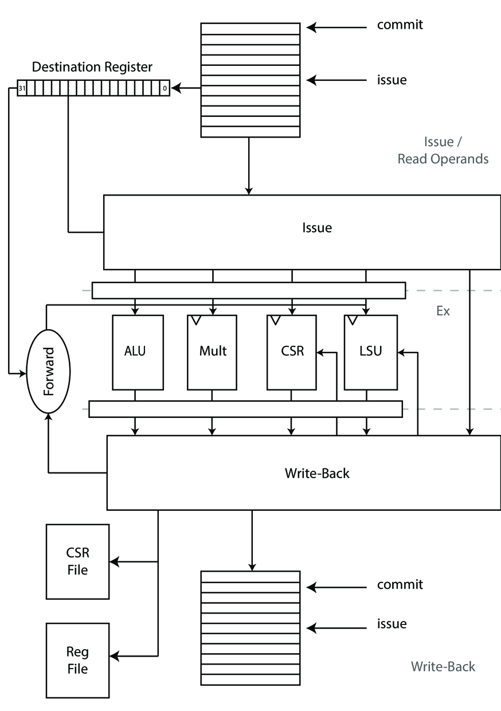

# Issue Stage

The issue stage's purpose is to receive the decoded instructions and
issue them to the various functional units. Furthermore the issue stage
keeps track of all issued instructions, the functional unit status and
receives the write-back data from the execute stage. Furthermore it
contains the CPU's register file. By using a data-structure called
scoreboard (see ) it knows exactly which instructions are issued, which
functional unit they are in and which register they will write-back to.
As previously mentioned you can roughly divide the execution in four
parts **1. issue**, **2. read operands**, **3. execute** and **4.
write-back**. The issue stage handles step one, two and four.

#### Issue

When the issue stage gets a new decoded instruction it checks whether
the required functional unit is free or will be free in the next cycle.
Then it checks if its source operands are available and if no other,
currently issued, instruction will write the same destination register.
Furthermore it keeps track that no unresolved branch gets issued. The
latter is mainly needed to simplify hardware design. By only allowing
one branch we can easily back-track if we later find-out that we've
mis-predicted on it.

By ensuring that the scoreboard only allows one instruction to write a
certain destination register it easies the design of the forwarding path
significantly. The scoreboard has a combinatorial circuit which outputs
the status of all 32 destination register together with what functional
unit will produce the outcome. This signal is called `rd_clobber`.

The issue stage communicates with the various functional units
independently. This in particular means that it has to monitor their
ready and valid signals, receive and store their write-back data
unconditionally. It will always have enough space as it allocates a slot
in the scoreboard for every issued instruction. This solves the
potential structural hazards of smaller microprocessors. This modular
design will also allow to explore more advanced issuing technique like
out-of-order issue ().

The issuing of instructions happen in-order, that means order of program
flow is naturally maintained. What can happen out-of-order is the
write-back of each functional unit. Think for example, that the issue
stage issues a multiplication which takes $n$ clock cycles to produce a
valid result. In the next cycle the issue stage issues an ALU
instruction like an addition. The addition will just take one clock
cycle to return and therefore return before the multiplication's result
is ready. Because of this we need to assign IDs to the various issue
stages. The ID resembles the (unique) position in which the scoreboard
will store the result of this instruction. The ID (called transaction
ID) has enough bits to uniquely represent each slot in the scoreboard
and needs to be passed along with the other data to the corresponding
functional unit.

This scheme allows the functional units to operate in complete
independence of the issue logic. They can return different transactions
in different order. The scoreboard will know where to put them as long
as the corresponding ID is signaled alongside the result. This scheme
even allows the functional unit to buffer results and process them
entirely out-of-order if it makes sense to them. This is a further
example of how to efficiently decouple the different modules of a
processor.

#### Read Operands

Read operands is physically happens in the same cycle as the issuing of
instructions but can be conceptually thought of as another stage. As the
scoreboard knows which registers are getting written it can handle the
forwarding of those operands if necessary. The design goal was to
execute two ALU instructions back to back (e.g.: with no bubble in
between). The operands come from either the register file (if no other
instruction currently in the scoreboard will write that register) or be
forwarded by the scoreboard (by looking at the `rd_clobber` signal).

The operand selection logic is a classical priority selection giving
precedence to results form the scoreboard over the register file as the
functional unit will always produce the more up to date result. To
obtain the right register value we need to poll the scoreboard for both
source operands.

#### Scoreboard

The scoreboard is implemented as a FIFO with one read and one write port
with valid and acknowledge signals. In addition to that it provides the
aforementioned signals which tell the rest of the CPU which registers
are going to be clobbered by a previously scheduled instruction.
Instruction decode directly writes to the scoreboard if it is not
already full. The commit stage looks for already finished instructions
and updates the architectural state. Which either means going for an
exception, updating the register or CSR file.

